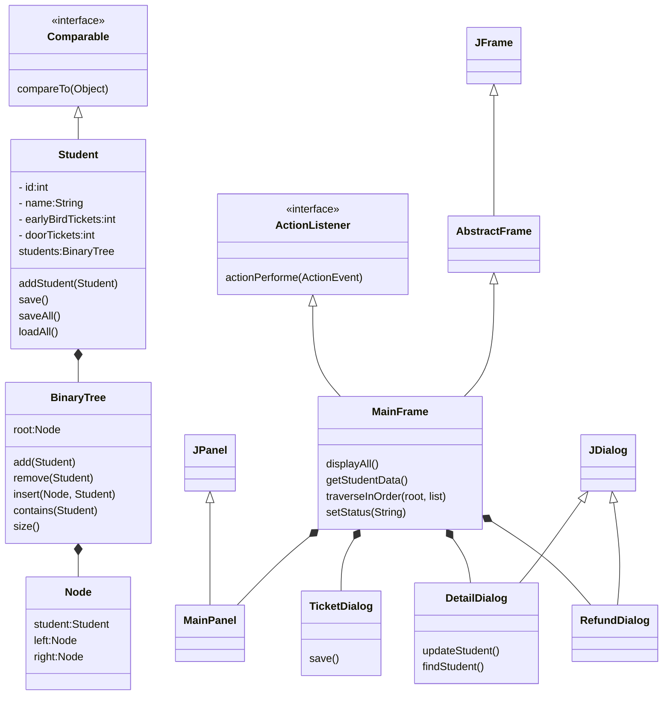
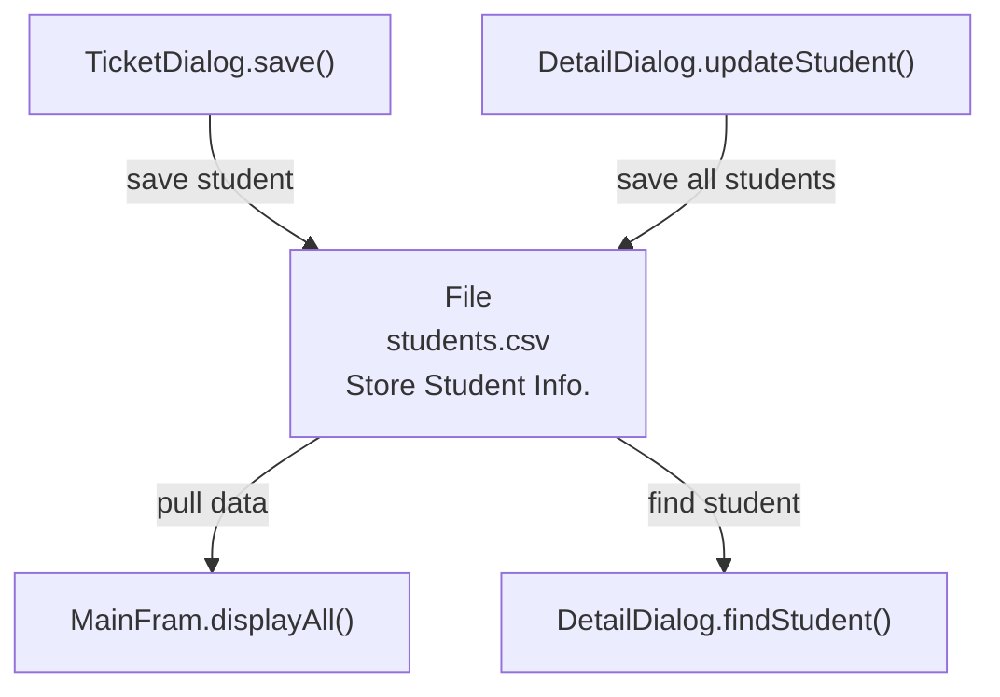

<h1>School Dance Ticket Software</h1>

* Students pay for tickets (+ guest)
* Early bird price
* ❓ Cross reference against student number list

```mermaid
classDiagram
class Comparable{
    <<interface>>
    compareTo(Object)
}
class Student{
    - id:int
    - name:String
    - earlyBirdTickets:int
    - doorTickets:int
    students:BinaryTree
    addStudent(Student)
    save()
    saveAll()
    loadAll()
}

class BinaryTree{
    root:Node
    add(Student)
    remove(Student)
    insert(Node, Student)
    contains(Student)
    size()
}

class Node{
    student:Student
    left:Node
    right:Node
}
Comparable<|--Student
BinaryTree *-- Node
Student *-- BinaryTree

class ActionListener{
    <<interface>>
    actionPerforme(ActionEvent)
}
class MainFrame{
    displayAll()
    getStudentData()
    traverseInOrder(root, list)
    setStatus(String)
}

class TicketDialog{
    save()
}

class DetailDialog{
    updateStudent()
    findStudent()
}
JFrame<|--AbstractFrame
AbstractFrame <|-- MainFrame
ActionListener<|--MainFrame
MainFrame *--MainPanel
JPanel<|--MainPanel
JDialog<|--DetailDialog
MainFrame *-- DetailDialog
JDialog<|-- RefundDialog
MainFrame *-- RefundDialog
MainFrame *-- TicketDialog
```

```mermaid
graph TB
MAIN_GET["MainFram.displayAll()"]
TICKET["TicketDialog.save()"]
UPDATE["DetailDialog.updateStudent()"]
DETAIL["DetailDialog.findStudent()"]
FILE["File<br/>students.csv<br/>Store Student Info."]
FILE--pull data-->MAIN_GET
TICKET--save student-->FILE
UPDATE--save all students-->FILE
FILE--find student-->DETAIL
```