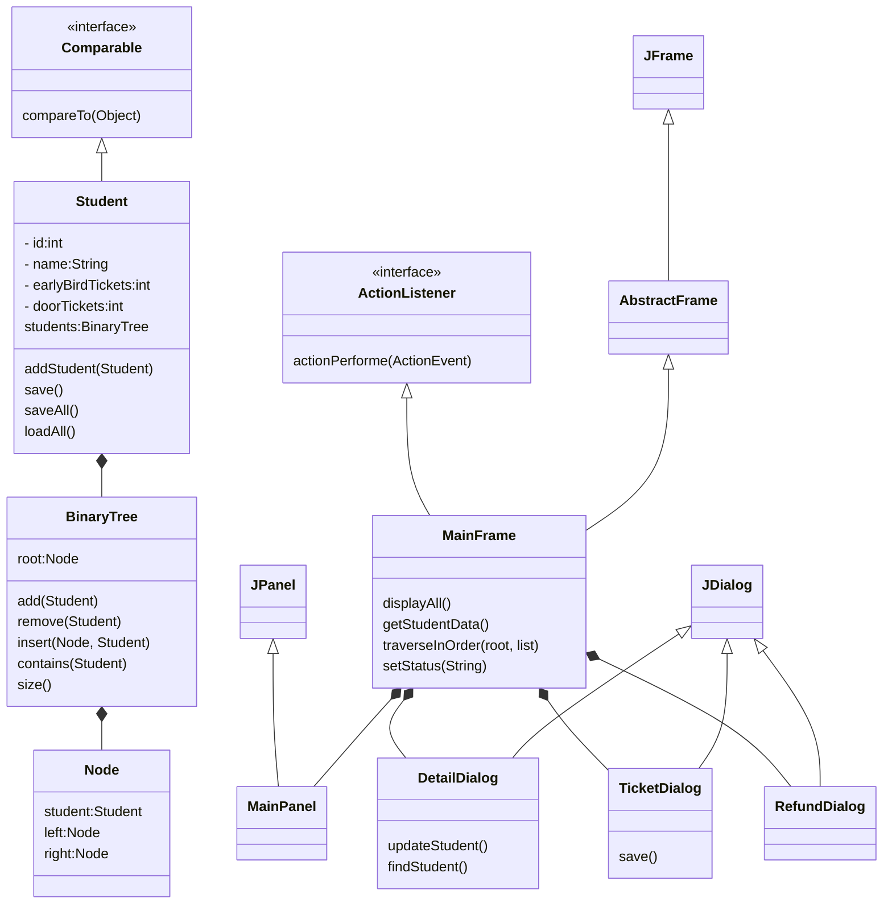
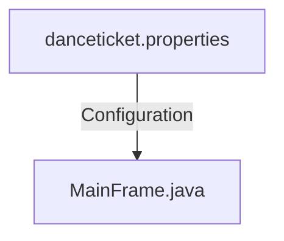
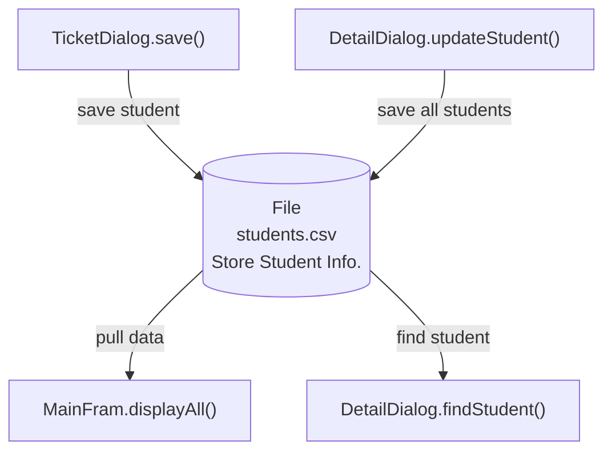
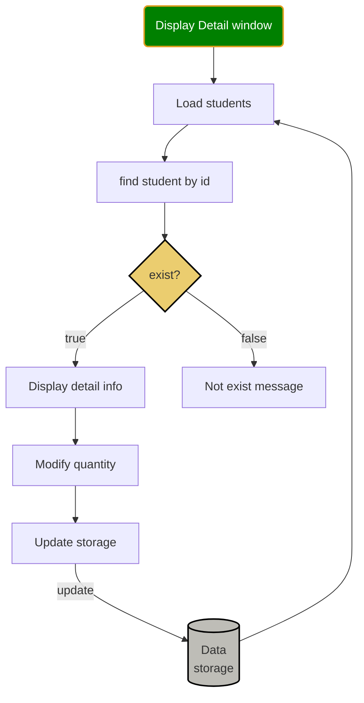
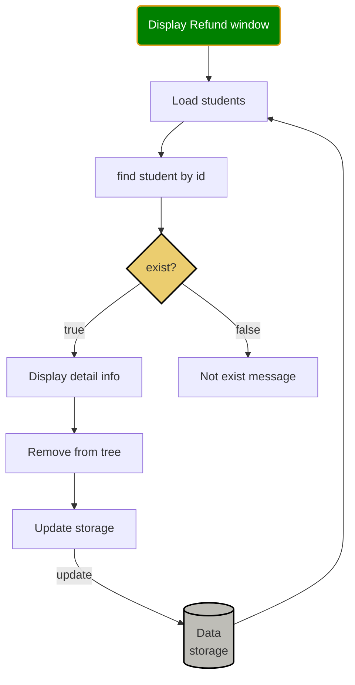
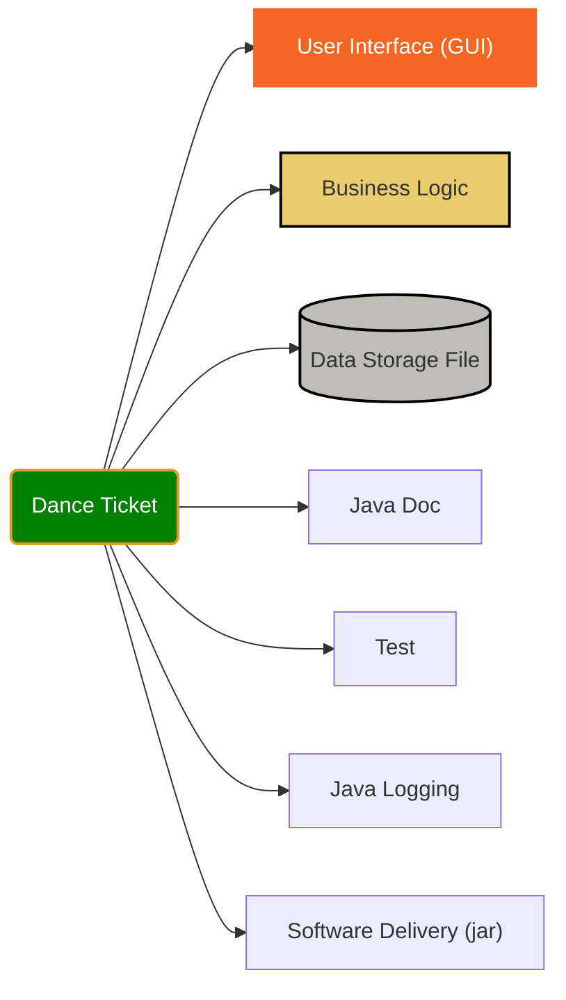

<h1>School Dance Ticket Software</h1>

<h2>Table of Contents</h2>

- [Completion Check](#completion-check)
- [Class Diagram](#class-diagram)
- [Configuration & Data store files](#configuration--data-store-files)
- [Flowchart](#flowchart)
- [Test](#test)
- [Java Docs](#java-docs)
- [Deployment (jar)](#deployment-jar)
- [Logging](#logging)
- [Software include](#software-include)

## Completion Check
❓ ⚡️😢 Cross referenced against student number list
✔️ Methods (add() recursive method)
✔️ Loops (insert() while loop, )
✔️ Decision structures (if-else, switch)
1. allow student buy early bird tickets for cheap price;
2. allow student buy more than one tickets for guests;
3. allow student buy door price tickets;
4. allow student refund his/her tickets;
5. allow display all students information on a table in the order of student id;
6. if student does NOT exist while refund, the message will be displayed on status bar at the bottom.
7. main window shall display party start time, duration, location and sponsor information
8. it is better to have help document for user.
9. [Basic operation check: add, save, load, insert, remove ...](Test.java)
10. ❓💡 What is the difference between add() and insert() method in BinaryTree?


✔️ UML - class, attributes, method... 👇[See below](#class-diagram)
❓ Original ideas and design complexity
✔️ Data Structure - applicable, Generic [See Node.java and BinaryTree.java]
✔️ Functionality - Ticket(early bird, door price, refund), Find(one.update, all), Help
✔️ Use of Tree data structure - BinaryTree, Node
✔️ Naming conventions (Camel style, upercase for class, lower case for fields and methods)
🔨 Comments/Docs
✔️🔨 Code readability (fields and methods naming, function single responsibility)
✔️ User Interface (MainFram, MainPanel, DetailDialog, RefundDialog, ...)
✔️ UML Layout/presentation
✔️ File I/O (see Student.save(), Student.saveAll(), Student.loadAll())
✔️ Data Structure (ArrayList, LinkedList, Queue) 😢May not be used🚧
✔️ Basic operations (implemented size, contains, add, insert, find, but only used add, find)😢May not be used🚧
✔️ Advanced operation - remove() (BinaryTree.remove()==>refund ticket)
✔️ Use of a Tree data structure (BinaryTree.java)
✔️ Use file I/O to load/save configuration (danceticket.properties) and data (tickets.csv)
✔️ must incorporate your own data structure(s) (BinaryTree, Node, BinaryTree.find, BinaryTree.remove)

## Class Diagram

## Configuration & Data store files



## Flowchart
* Detail Operation Logic


* Refund Operation Logic

## Test
[test BinaryTree add(), loadAll(), saveAll(), Find(), Insert(), Remove()](../john/src/com/john/danceticket/Test.java)

also test configuration properties load(), Date format.

## Java Docs
```DOS
Open DOS command window, cd to the folder below, type in javadoc command

C:\Users\12818\workspace\Rodney\java\doc\danceticket>javadoc -sourcepath ../../john/src -subpackages com.john.danceticket
```


Double click index.html file name


## Deployment (jar)
1. [Ant build](../john/build.xml)
2. target: dist
3. Generate danceticket.jar
```file structures
<project root>
    ├── 🔨build.xml
    |      
    ├── 🔥build/
    |      ├── com
    |      ├── resources
    |      └── logging.properties
    └── 🎯dist
           └── lib
                └── danceticket.jar
```
to Run the jar file
```DOS
cd <danceticket.jar folder>
java -jar danceticket.jar
```

❗️⚡️💡 Very important: 
1. In order to run the jar file, put all configuration and resource files (logging.properties, dance.jpg, danceticket.properties) in classpath.
2. use InputStream to read file, instead of FileReader.
```java
		String imageFile = parent.getProp().getProperty(IMAGE_FILE_PROP);
        // load image file by using InputStream
		InputStream imgIn = MainPanel.class.getClassLoader().getResourceAsStream(imageFile);
		try {
			img = ImageIO.read(imgIn);
		} catch (IOException e) {
			e.printStackTrace();
		}
```

```java
	private void loadProperties() {
		logger.info("loadProperties() ...");
		prop = new Properties();
        // load resources/danceticket.properties file using InputStream
		InputStream in = MainFrame.class.getClassLoader().getResourceAsStream(PROP_FILE);
		try {
			// load a properties file
			prop.load(in);
		} catch (IOException ex) {
			logger.severe(ex.getMessage());
		}
	}

```

Run danceticket.jar on DOS command window.
```dos
C:\Users\12818\workspace\Rodney\java\john\dist\lib>java -jar danceticket.jar
file:/C:/Users/12818/workspace/Rodney/java/john/dist/lib/danceticket.jar!/logging.properties
```
## Logging
1. Logging configuration file: logging.properties
2. logging output file: <userhome>/workspace/Rodney/java/mylogs%u.log
3. Create logger
```java
	static {
//		System.setProperty("java.util.logging.config.file", "/Users/12818/workspace/Rodney/java/john/conf/logging.properties");
		String path = MainFrame.class.getClassLoader().getResource("logging.properties").getFile();
		System.setProperty("java.util.logging.config.file", path);		
//		System.setProperty("java.util.logging.ConsoleHandler.level", "java.util.logging.Level.WARNING");
	}
	static Logger logger = Logger.getLogger("DANCE_TICKET");
```

## Software include

