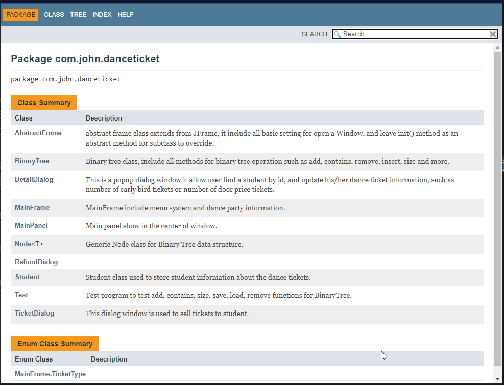

<h1>School Dance Ticket Software</h1>

* Students pay for tickets (+ guest)
* Early bird price
* ❓ Cross reference against student number list

## Completion Check
❓ Methods (add() recursive method)
❓ Loops (insert() while loop, )
❓ Decision structures
1. allow student buy early bird tickets for cheap price;
2. allow student buy more than one tickets for guests;
3. allow student buy door price tickets;
4. allow student refund his/her tickets;
5. allow display all students information on a table in the order of student id;
6. if student does NOT exist while refund, the message will be displayed on status bar at the bottom.
7. main window shall display party start time, duration, location and sponsor information
8. it is better to have help document for user.
9. [Basic operation check: add, save, load, insert, remove ...](Test.java)
10. ❓💡 What is the difference between add() and insert() method in BinaryTree?


✔️ UML - class, attributes, method... 👇[See below](#class-diagram)
❓ Original ideas and design complexity
✔️ Data Structure - applicable, Generic [See Node.java and BinaryTree.java]
✔️ Functionality - Ticket(early bird, door price, refund), Find(one.update, all), Help
✔️ Use of Tree data structure - BinaryTree, Node
✔️ Naming conventions (Camel style, upercase for class, lower case for fields and methods)
🔨 Comments/Docs
✔️🔨 Code readability (fields and methods naming, function single responsibility)
✔️ User Interface (MainFram, MainPanel, DetailDialog, RefundDialog, ...)
❓ UML Layout/presentation
✔️ File I/O (see Student.save(), Student.saveAll(), Student.loadAll())
✔️❓ Data Structure (ArrayList, LinkedList, Queue)
✔️❓ Basic operations (implemented size, contains, add, insert, find, but only used add, find)
✔️ Advanced operation - remove() (BinaryTree.remove())
✔️ Use of a Tree data structure (BinaryTree.java)
✔️ Use file I/O to load/save configuration (danceticket.properties) and data (tickets.csv)
✔️ must incorporate your own data structure(s) (BinaryTree, Node, BinaryTree.insert)

## Class Diagram

## Data store file


## Flowchart
* Detail Operation Logic


* Refund Operation Logic


## Java Docs
```DOS
Open DOS command window, cd to the folder below, type in javadoc command

C:\Users\12818\workspace\Rodney\java\doc\danceticket>javadoc -sourcepath ../../john/src -subpackages com.john.danceticket
```


Double click index.html file name



## Software include

