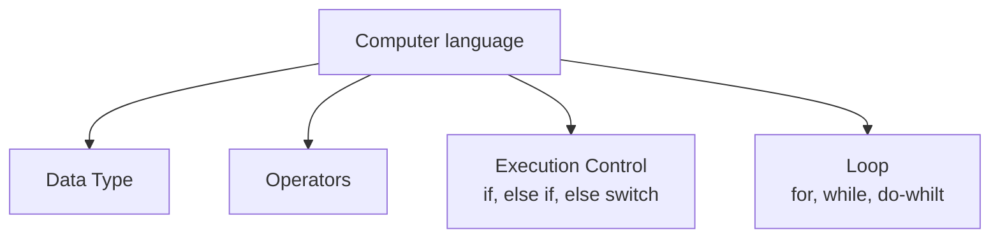
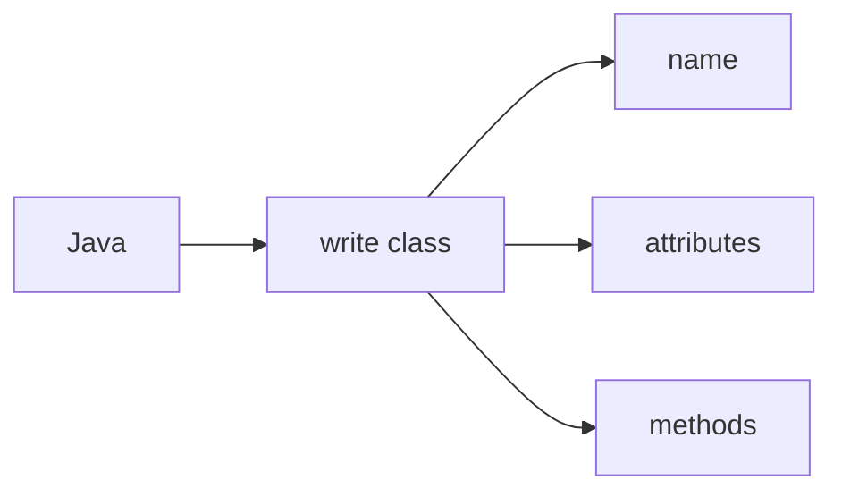
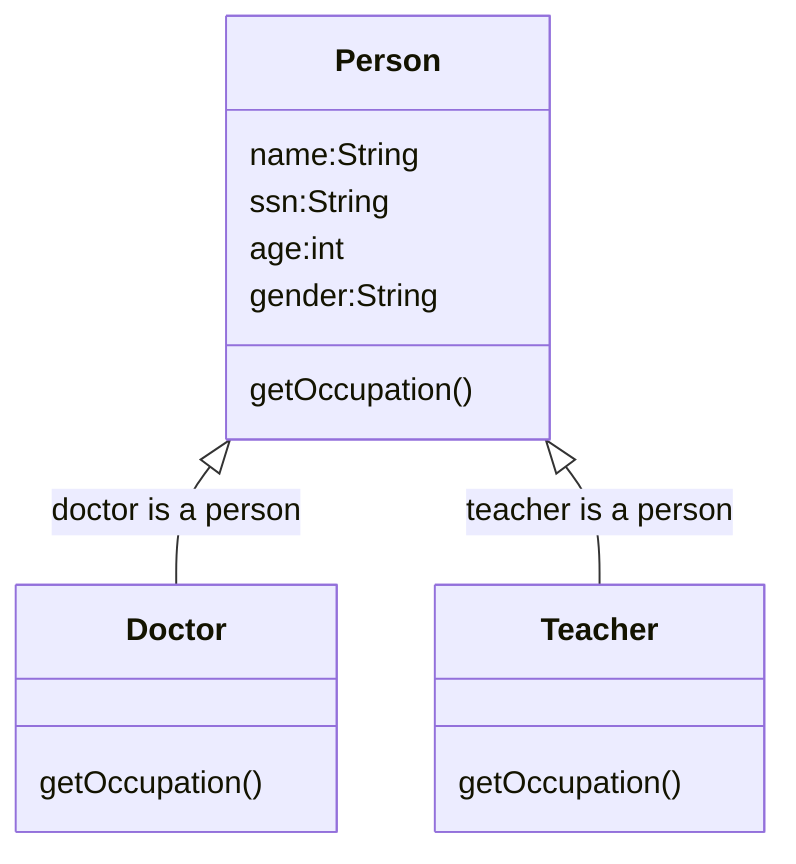
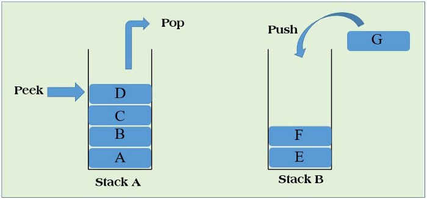
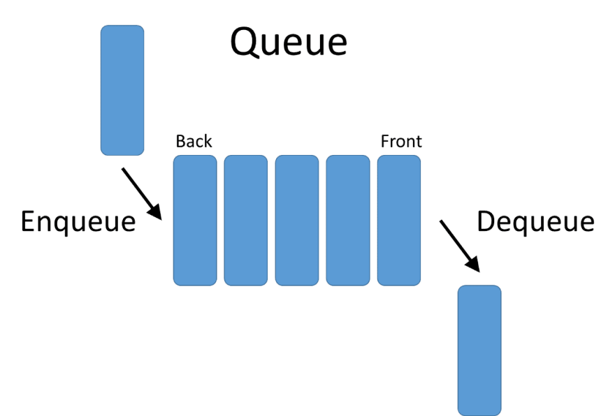
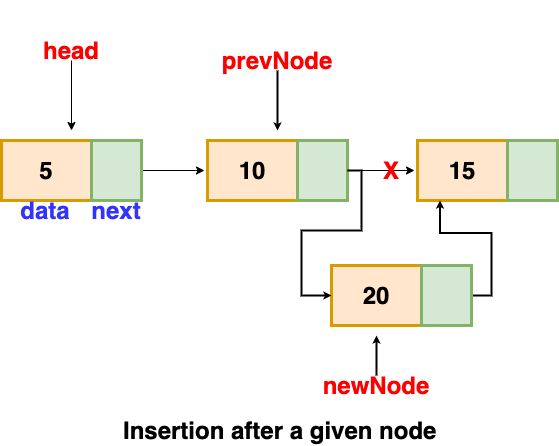
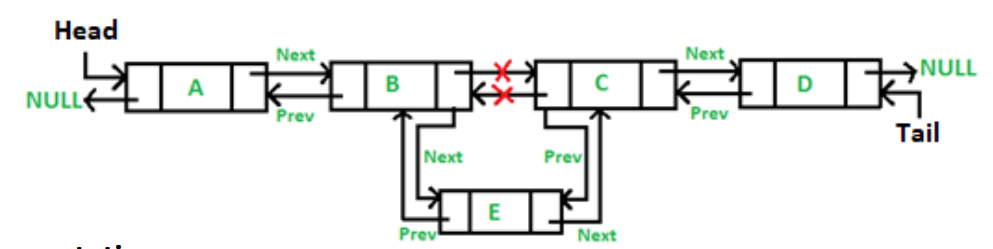
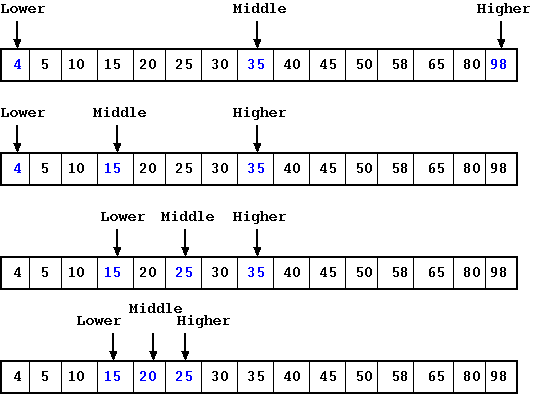

# Java Class Notes

[Java API Document](https://docs.oracle.com/javase/8/docs/api/)
❓What is **Object** class?
✔️Class Object is the root of the class hierarchy. Every class has Object as a superclass. All objects, including arrays, implement the methods of this class.

## Getting start
❓ How to create java project
✔️

❓ How to create a package?
✔️

❓ How to create java source code
✔️

❓ How to run Java source code?
✔️

❓ How to debug Java source code?
✔️

## Language Basic





1. modifier: public, static, private, protected, to modify class, method, and variable.
2. toString() method: Returns a string representation of the object.
3. OOP: class include name, attributes and methods.
4. main(): special method the JRE will use to start the application, can be used as test block. the signature of main() cannot be changed.
5. String[] args: array of command line arguments input.
    Right-click project name > Properties > Run/Debug Settings > Edit > Arguments
    The values of args can be used in the code.
6. Static method call by static way.
❓ What is a static method?
✔️
7. variable scope: instance level, class level, local method level.

Java compile source code (.java) to byte code (.class), JRE can only run class file.

## Data type
1. primitive data type (boolean, byte, char, short, int, long, float, double)
2. Java defined data type (String, Scanner, System, ...); new <class name>
3. Developer defined data type; new <class name>

## Operator
1. arithmetic (+, -, *, /, %)
2. assignment (=, +=, -=, *=, /=, %=)
3. logical (&&, ||)
4. comparison (<, >, <=, >=, ==)
5. binary (++, --)
6. ternary: a<b?a:b
7. bitwise: &, |, ^
8. precedence: 先*,/；后+-; ()

## Execution Control
* if-else if-else
* switch

## Loop
* for loop, 
* for-each
* while loop
* do-while loop
* continue; break

## OOP
1. Abstraction (把从实际生活中的实体编写成class，为你所用)
2. Inheritence （把共同的东西总结到super class，save coding）
3. Encapsulation (protect attribute to be accessed by outside)
4. Polymorphism (多样性，give different answer by the same quetion)

> ⚡️💡 Every object can do whatever it supposed to be able to do!❗️❗️❗️

* 3 different class type
1. interface
2. abstract class
3. concrete class

* interface only define signature of methods with no method body.
* cannot use interface to instantiate an interface type.


## class
1. name
2. attributes
3. methods (Constructor, function)

❓ What is a constructor?
✔️ Constructor is special method which return an instance of the class.
1. Constructor is similar to other method without return type.
2. constructor can use public, default modifier (cannot use protected modifier)
3. 😢default constructor is a constructor without any argments, 😢if you define other constructor, the default constructor no longer available.
4. 👍you can define as many different constructors as you want.
5. 😢Subclass cannot use superclass constructor.

   
❓ what is an interface?
✔️the **interface** is special java data type which only define method signature (finger print) without implementation or some constant variables.

**implements** is java reserved keywords which means the class need implement all methods defined in the interface or itself must to be abstract.

Treat interface as an agreement.

1. cannot use interface to create an object.
2. 👍java class can implements more than one interfaces.
3. 👍😄call method before its implementation.
4. all methods in interface are public and abstract
5. all variables in interface are constants
6. all classes which implements an interface must implements all methods declared in the interface.


❓ what is an abstract class?
✔️ Abstract class is similar to interface which cannot be used to create object. It may contain a mix of methods with or without implementation. It is not completed class, this is why cannot use it to create an object. It can define common used methods.

1. cannot use abstract class to create instance. (possible incompleted)
2. abstract class can have abstract method.
3. implements common methods for all subclasses.
4. leave subclass specified method as abstract method for subclass to implement.
5. all concrete subclasses need to implement all abstract methods declared in abstract super class, or make itself to be abstract.

## try-catch code block and Exception

if one method throws Exception, you must handle the Exception when you call the method.

❓ why need try-catch block?
✔️ when you call a method, if the method throw regular Exception, then you need use try-catch block.
There are two possible type of Exceptions:
1. Regular Exception
2. Runtime Exception 

There are two ways to handle Exception:

📌❗️ if call a method which throws a regular Exception, the method itself try-catch the Exception, 
📌❗️ or itself must throws the Exception.

Create a customer Exception such as InvalidValueException.

InvalidValueException is a Exception.

>TDD: Test Driving Developping

## Unit test
📌 create **test** folder under myproject, then add it into my source.
1. Right-click project name > properties > Source tab > [Add Folder] > select test
2. Create sample package
3. Create JUnit Test Case

```
input values must cover all possible input values
```
## Data Structure
* [Stack]
* [Queue]
* [Generics]
* [Linked List](../john/src/com/john/myproject/LinkedList.java)
*  
## Logging

## Blackjack 
* [Design document](blackjack.md)
* [Game.java](../src/../john/src/com/john/blackjack/Game.java)
* [Dealer.java](../john/src/com/john/blackjack/Dealer.java)
* [Player.java](../john/src/com/john/blackjack/Player.java)
* [Deck.java](../john/src/com/john/blackjack/Deck.java)
* [Card.java](../john/src/com/john/blackjack/Card.java)
* [Face.java](../john/src/com/john/blackjack/Face.java)
* [Suit.java](../john/src/com/john/blackjack/Suit.java)

## Data Structure
* 
* 
* [Linked List](../john/src/com/john/myproject/LinkedList.java)

* [Doubly Linked List](../john/src/com/john/myproject/DoublyLinkedList.java)

* 

* [Teolitz matrix java](../john/src/com/john/myproject/TeoplitzTest.java)

[Toeplitz matrix](https://en.wikipedia.org/wiki/Toeplitz_matrix)
$$ A_{i,j} = A_{i+1, j+1} $$
> A Toeplitz matrix is not necessarily square.

binary search worst case:
$$f(n)=log_2 n $$
$$O(log_2 N)$$

$$f(n) = \frac {n+1} 2 = \frac 1 2 n + \frac 1 2$$

### Tree


## Java GUI (swing)
* [Open window](../john/src/com/john/swing/OpenWindow.java)

### Basic Components
* [AddButton.java](../john/src/com/john/swing/AddButton.java)
  1. Anonymous class (new interface with implementation)
* [AddLabel.java](../john/src/com/john/swing/AddLabel.java)
* [AddTextField.java](../john/src/com/john/swing/AddTextField.java)
* [AddCheckBox.java](../john/src/com/john/swing/AddCheckBox.java)
* [Frame.java](../john/src/com/john/swing/Frame.java)

### Dispaly image on JPanel
* [DisplayImage.java](../john/src/com/john/swing/DisplayImage.java)
* [MyPanel.java](../john/src/com/john/swing/MyPanel.java)
* [DisplayImageOnLabel](../john/src/com/john/swing/DisplayImageOnLabel.java)
* [DisplayImageOnButton](../john/src/DisplayImageOnButton.java)
* [For Cornor Images](../john/src/com/john/swing/FourCornersImage.java)
* [diagonal moving image](../john/src/com/john/swing/MovingImage.java)
* [diagonal moving panel](../john/src/com/john/swing/MyPanel1.java)
* [Random moving image](../john/src/com/john/swing/RandomMovingImage.java)
* [Random moving panel](../john/src/com/john/swing/MyPanel2.java)
* [Key control moving image](../john/src/com/john/swing/KeyControledImage.java)
* [Key control panel](../john/src/com/john/swing/MyPanel3.java)
* [Calculator](../john/src/com/john/swing/Calculator.java)

### Layout
* [Flow Layout](../john/src/com/john/swing/FlowLayoutExample.java)
* [Border Layout](../john/src/com/john/swing/BorderLayoutExample.java)
* [Embedded Border Layout](../john/src/com/john/swing/BorderLayoutExample1.java)
* [Grid Layout](../john/src/com/john/swing/GridLayoutExample.java)
* [Grid Bag Layout](../john/src/com/john/swing/GridBagLayoutExample.java)
* [Box Layout]
* [Group Layout]
