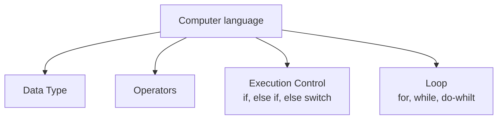
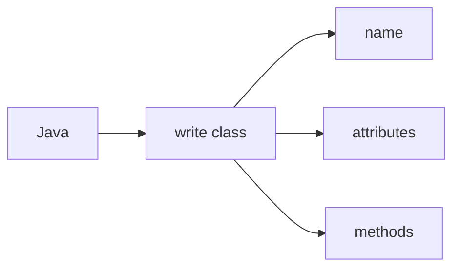
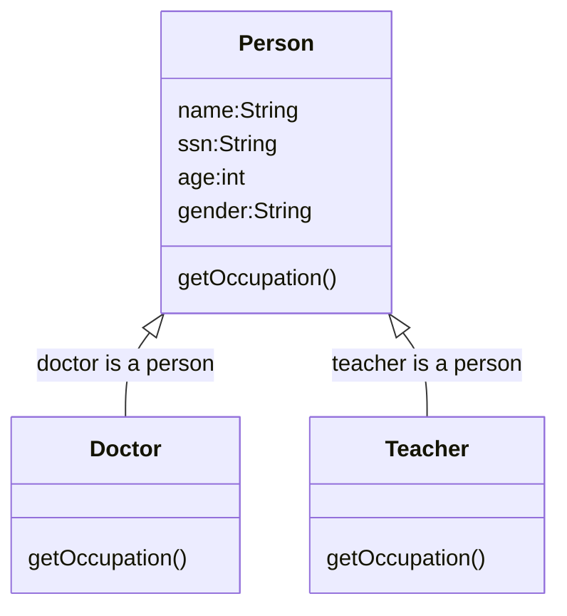

# Java Class Notes

[Java API Document](https://docs.oracle.com/javase/8/docs/api/)
❓What is **Object** class?
✔️Class Object is the root of the class hierarchy. Every class has Object as a superclass. All objects, including arrays, implement the methods of this class.

## Getting start
❓ How to create java project
✔️

❓ How to create a package?
✔️

❓ How to create java source code
✔️

❓ How to run Java source code?
✔️

❓ How to debug Java source code?
✔️

## Language Basic

1. modifier: public, static, private, protected, to modify class, method, and variable.
2. toString() method: Returns a string representation of the object.
3. OOP: class include name, attributes and methods.
4. main(): special method the JRE will use to start the application, can be used as test block. the signature of main() cannot be changed.
5. String[] args: array of command line arguments input.
    Right-click project name > Properties > Run/Debug Settings > Edit > Arguments
    The values of args can be used in the code.
6. Static method call by static way.
❓ What is a static method?
✔️
7. variable scope: instance level, class level, local method level.

Java compile source code (.java) to byte code (.class), JRE can only run class file.

## Data type
1. primitive data type (boolean, byte, char, short, int, long, float, double)
2. Java defined data type (String, Scanner, System, ...); new <class name>
3. Developer defined data type; new <class name>

## Operator
1. arithmetic (+, -, *, /, %)
2. assignment (=, +=, -=, *=, /=, %=)
3. logical (&&, ||)
4. comparison (<, >, <=, >=, ==)
5. binary (++, --)
6. ternary: a<b?a:b
7. bitwise: &, |, ^
8. precedence: 先*,/；后+-; ()

## Execution Control
* if-else if-else
* switch

## Loop
* for loop, 
* for-each
* while loop
* do-while loop
* continue; break

## OOP
1. Abstraction (把从实际生活中的实体编写成class，为你所用)
2. Inheritence （把共同的东西总结到super class，save coding）
3. Encapsulation (protect attribute to be accessed by outside)
4. Polymorphism (多样性，give different answer by the same quetion)

* 3 different class type
1. interface
2. abstract class
3. concrete class

* interface only define signature of methods with no method body.
* cannot use interface to instantiate an interface type.

❓ what is an interface?
✔️the **interface** is special java data type which only define method signature (finger print) without implementation or some constant variables.

**implements** is java reserved keywords which means the class need implement all methods defined in the interface or itself must to be abstract.

❓ what is an abstract class?
✔️ Abstract class is similar to interface which cannot be used to create object. It may contain a mix of methods with or without implementation. It is not completed class, this is why cannot use it to create an object. It can define common used methods.