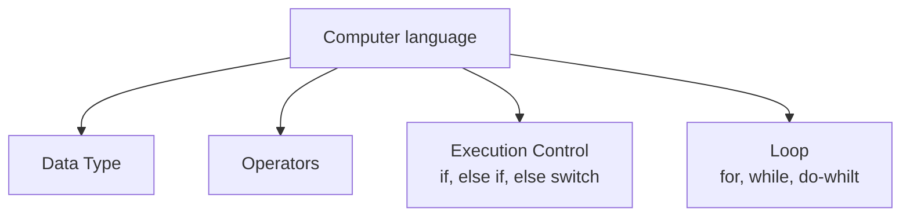
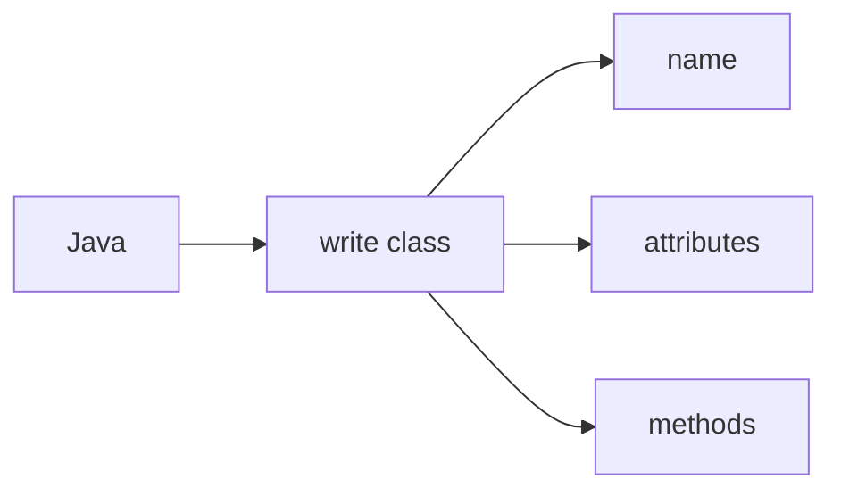

# Java Class Notes

[Java API Document](https://docs.oracle.com/javase/8/docs/api/)
❓What is **Object** class?
✔️Class Object is the root of the class hierarchy. Every class has Object as a superclass. All objects, including arrays, implement the methods of this class.

## Getting start
❓ How to create java project
✔️

❓ How to create a package?
✔️

❓ How to create java source code
✔️

❓ How to run Java source code?
✔️

❓ How to debug Java source code?
✔️

## Language Basic

1. modifier: public, static, private, protected, to modify class, method, and variable.
2. toString() method: Returns a string representation of the object.
3. OOP: class include name, attributes and methods.
4. main(): special method the JRE will use to start the application, can be used as test block. the signature of main() cannot be changed.
5. String[] args: array of command line arguments input.
    Right-click project name > Properties > Run/Debug Settings > Edit > Arguments
    The values of args can be used in the code.
6. Static method call by static way.
❓ What is a static method?
✔️
7. variable scope: instance level, class level, local method level.

Java compile source code (.java) to byte code (.class), JRE can only run class file.