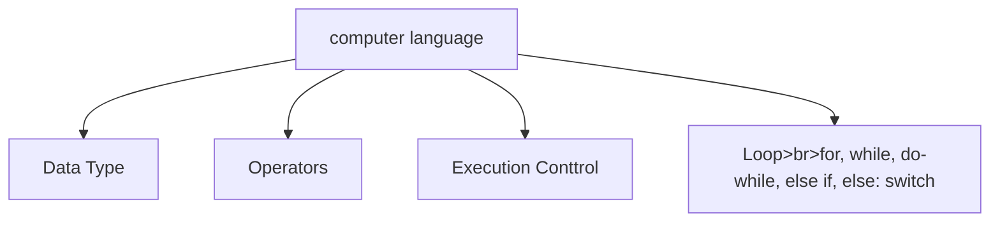
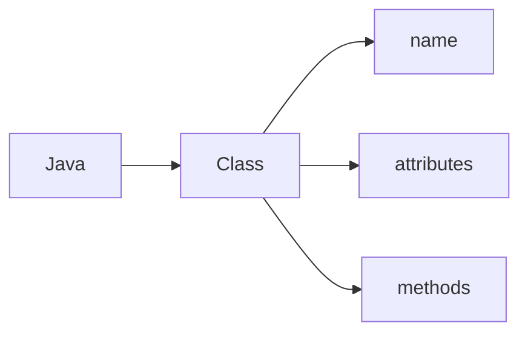

## Java class notes
[Java API Document](https://docs.oracle.com/javase/8/docs/api/)

## Language basic

1. modifier: public, static, private, protective, to modify class, method and variable
2. toString() method: Return a string representation of the object
3. OOP: class include name, attributes and methods.
4. main(): special method the JRE will use to start the application, can be used as test block. the signature of main() 
5. String[] args: array of command line arguments input 
   Right-click project name > properties > Run>Degub settings > Edit button > Edit > Arguments
    The values of args can be used in the code
6. static method call by static way
7. variable scope: instance level, class level, local method level

Java compile source code (.java) to byte code (.class), JRE can only run class file